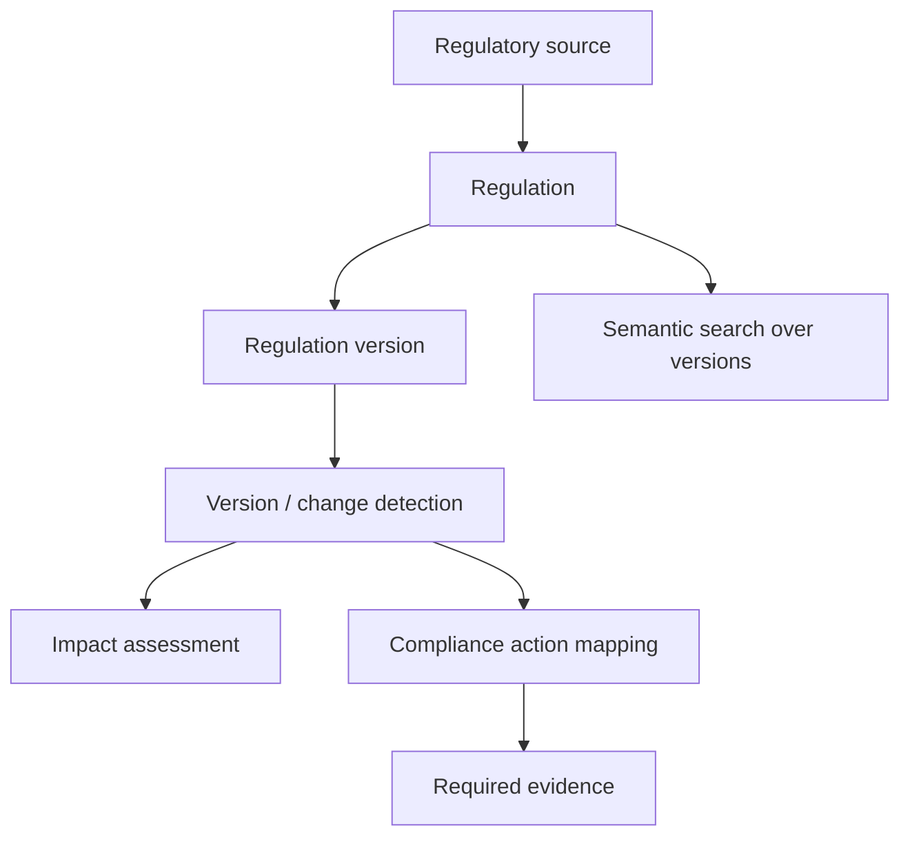
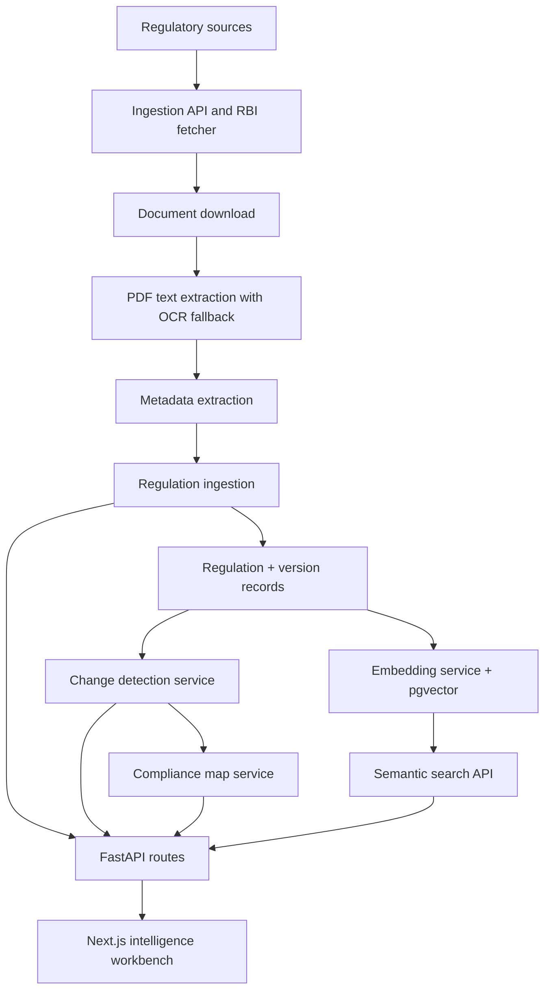

# RegIntelX
RegIntelX is a regulatory intelligence platform that turns regulatory source documents into versioned changes, compliance actions, and evidence-backed workflow items.

## What it does
Organizations have to monitor regulatory documents, understand what changed, assess business impact, and convert those changes into concrete compliance work.

RegIntelX addresses that workflow by:
- registering regulatory sources
- ingesting source documents into regulation records and version history
- extracting text, metadata, and embeddings from documents
- detecting changes between regulation versions
- classifying impact and generating compliance actions
- keeping required evidence and source traceability attached to each action
- surfacing the result in a Next.js intelligence workbench

## Core workflow


## Key capabilities
Only the capabilities implemented in this repository are listed here.

- Regulatory source management through FastAPI CRUD routes.
- Regulation ingestion and enrichment from downloaded documents.
- PDF text extraction with OCR fallback for image-based PDFs.
- Metadata extraction for title, circular number, issue date, and effective date.
- Regulation versioning with document hashes and stored extracted text.
- Version-based change detection using text chunking and sequence matching.
- Impact classification based on the size of detected textual change.
- Domain tagging from change content using keyword-based heuristics.
- Compliance map generation with priority, risk score, due date, and required evidence.
- Semantic search over regulation versions using Hugging Face embeddings and pgvector.
- Regulation intelligence detail views in the Next.js frontend.
- Source traceability from actions back to regulations and changes.
- Compliance action tracking with status updates.
- RBI-specific ingestion endpoints for the current regulatory source workflow.

## Architecture
RegIntelX is split into a FastAPI backend and a Next.js frontend.

- `backend/app/api/routes` exposes source, regulation, change, map, ingestion, and health endpoints.
- `backend/app/ingestion` handles document download, PDF extraction, metadata extraction, and regulation ingestion.
- `backend/app/services` contains change detection, compliance map generation, semantic search, embedding generation, and RBI ingestion helpers.
- `backend/app/models` contains the SQLAlchemy models for sources, regulations, versions, changes, and compliance maps.
- `backend/app/core` contains configuration, database setup, and rate limiting.
- `frontend/src/app` contains the route-level intelligence workbench.
- `frontend/src/components/regintelx` contains the shared UI shell and workflow cards.
- `frontend/src/lib/regintelx` contains the API client and frontend types.



## Tech stack
Backend:
- FastAPI 0.141.1
- SQLAlchemy 2.0.52
- psycopg 3.3.4
- pgvector 0.5.0
- pydantic 2.13.4
- pydantic-settings 2.15.0
- httpx 0.28.1
- pypdf 6.16.1
- pdf2image 1.17.0
- pytesseract 0.3.13
- slowapi 0.1.10
- uvicorn 0.52.4
- huggingface_hub

Frontend:
- Next.js 16.3.2
- React 19.2.8
- Motion 13.1.1
- TypeScript 5
- Tailwind CSS 4
- lucide-react 1.33.0
- @base-ui/react 1.7.0
- @supabase/supabase-js 2.109.0

## Project structure
```text
regintelx/
├── backend/
│   ├── app/
│   │   ├── api/routes/
│   │   ├── core/
│   │   ├── ingestion/
│   │   ├── models/
│   │   ├── schemas/
│   │   └── services/
│   ├── test_*.py
│   └── requirements.txt
├── frontend/
│   ├── src/app/
│   ├── src/components/regintelx/
│   ├── src/lib/regintelx/
│   ├── public/
│   └── package.json
├── render.yaml
└── README.md
```

## Getting started
These commands assume a fresh clone from the repository root.

### 1. Clone the repository
```bash
git clone https://github.com/Garima040106/RegIntelX.git
cd RegIntelX
```

### 2. Backend setup
Create and activate a Python virtual environment, then install dependencies:

```bash
python -m venv .venv
source .venv/bin/activate
pip install -r backend/requirements.txt
```

Create `backend/.env` with the required database connection string:

```bash
DATABASE_URL=postgresql://...
```

For semantic search and embedding generation, also provide a Hugging Face token in your shell environment:

```bash
export HF_TOKEN=your_huggingface_token
```

Run the backend from the repository root:

```bash
uvicorn backend.app.main:app --reload
```

### 3. Frontend setup
Install dependencies and start the Next.js app:

```bash
cd frontend
npm install
npm run dev
```

The frontend currently points at the deployed backend URL in `frontend/src/lib/regintelx/api.ts`. If you want to run the backend locally, update that constant to your local API address.

## API
Important backend endpoints currently implemented in `backend/app/api/routes`:

### Health
- `GET /health`
- `GET /health/database`

### Regulatory sources
- `GET /api/v1/sources`
- `GET /api/v1/sources/{source_id}`
- `POST /api/v1/sources`
- `PATCH /api/v1/sources/{source_id}`
- `DELETE /api/v1/sources/{source_id}`

### Regulations
- `GET /api/v1/regulations`
- `GET /api/v1/regulations/{regulation_id}`
- `GET /api/v1/regulations/{regulation_id}/versions`
- `GET /api/v1/regulations/{regulation_id}/versions/{version_number}`
- `GET /api/v1/regulations/search?q=...`
- `GET /api/v1/regulations/semantic-search?q=...&limit=...`

### Regulation changes
- `GET /api/v1/changes`
- `GET /api/v1/changes/{change_id}`
- `GET /api/v1/changes/preview?previous_version_id=...&new_version_id=...`
- `POST /api/v1/changes?regulation_id=...&new_version_id=...&previous_version_id=...`

### Compliance maps
- `GET /api/v1/maps`
- `GET /api/v1/maps/{map_id}`
- `POST /api/v1/maps/from-change/{change_id}`
- `PATCH /api/v1/maps/{map_id}/status?status=...`

### Ingestion
- `POST /api/v1/ingestion/rbi`
- `POST /api/v1/ingestion/rbi/process`

## Semantic search
Semantic search is implemented with real embeddings, not a mocked search layer.

The backend:
- generates embeddings with `huggingface_hub.InferenceClient`
- uses the `sentence-transformers/all-MiniLM-L6-v2` model
- stores vectors on `RegulationVersion.embedding` using `pgvector`
- queries with cosine distance and returns a similarity score plus evidence text extracted from the matching version

The frontend uses the semantic-search endpoint to power the regulation library search experience.

## Compliance intelligence
A detected regulatory change becomes compliance work through the backend services:

1. A new regulation version is stored in `regulation_versions`.
2. `change_detection_service.detect_change()` compares old and new extracted text with `SequenceMatcher`.
3. The service builds a change summary, impact level, and affected domains from the text.
4. `compliance_map_service.create_maps_for_change()` turns the change into one or more `ComplianceMap` rows.
5. Each map stores a title, description, priority, status, due date, risk score, and required evidence.

The current implementation is heuristic and rule-based. It does not make autonomous compliance decisions.

## Security / deployment considerations
- Backend CORS currently allows the deployed Vercel frontend origin configured in `backend/app/main.py`.
- Ingestion endpoints are rate-limited with `slowapi`.
- `DATABASE_URL` and `HF_TOKEN` are environment secrets and should not be committed.
- `render.yaml` configures the backend for deployment on Render.
- There is no authentication or role-based access control in the current repository.

## Screenshots
No screenshots are committed yet. Add frontend captures here when you want to showcase the workbench in a presentation or demo.

## Current status
RegIntelX is a working prototype with:
- regulatory source management
- document ingestion and extraction
- version tracking
- change detection and impact classification
- semantic search
- compliance map generation
- a polished Next.js intelligence workbench

It is not yet a production compliance system, and it does not implement authentication, RBAC, notifications, audit trails, or human approval workflows.

## Future improvements
Potential follow-on work could include:
- more regulatory authorities and source types
- stronger document comparison and richer diff summaries
- human-in-the-loop review for change and action validation
- richer evidence management
- audit trails
- notifications and task assignment
- role-based access control
- on-premise or private deployment options
- stronger model-assisted impact analysis

## Why RegIntelX
RegIntelX is not merely a document search system. It connects regulatory change to operational compliance work.
